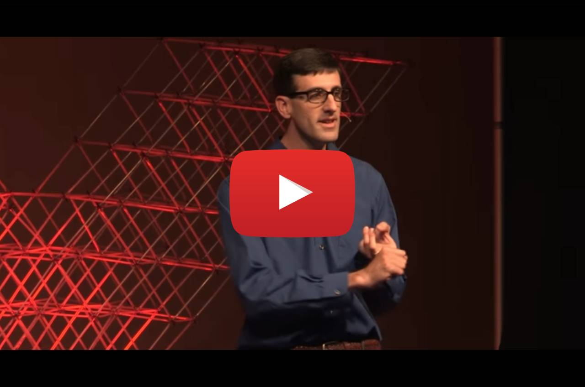

When we look at the past, we sometimes can more clearly understand the present. The world today is evolving faster than ever before in terms of socio-technological factors. As it does, cultures,  people groups, and even nations struggle to keep up. Long ago when shifts of power in the form of colonization happened, destabilization of existing societies followed. Historically this has been the case. The Lakota, an indigenous Native American tribe in the United States has such a story. They are a people whose culture, language and lands were nearly all but taken from them not many generations ago. Yet, they survive. Still, there is much suffering today as a consequence of this darkened past in US history. Forgetting will not heal those wounds. Yet, what can be done, and why should we care? 

## Why Care?

An answer to this question was given by [Peter Hill](https://www.linkedin.com/in/peter-hill-b229b180), who for years has worked with the Lakota people to preserve their language and culture. He is not Lakota himself by blood, only in spirit. He has a deep passion for the revitalization of the Lakota language and in 2012 he began the Lakota Immersion Daycare located on the Pine Ridge Indian Reservation in South Dakota. Some years ago he gave a talk for a [TEDx](https://www.youtube.com/channel/UCsT0YIqwnpJCM-mx7-gSA4Q) event about giving his life to a mission many may not understand. TED, is a media organization whose name stands for **Technology, Entertainment and Design**. Their slogan is "*ideas worth spreading*" and Peter's is definitely a message worth spreading even today. His passion and mission may be more relevant today than ever before. You can(and should) check his inspiring and passionate talk here:

As a disclaimer, this post and a future Lakota Project in the web3 space are not currently affiliated with Peter Hill, or the organizations referenced here. 

Like Peter's inspiration to begin the Lakota Immersion Childcare, I and others are inspired to help in whatever ways we know how. 

> There's nothing particularly special about me I was just the person who finally acquiesced took a deep breath and said well guess I'm doing this"
> 
> Peter Hill (Lakota Immersion Daycare)

In the coming months, a public goods project involving indigenous aspects will be launched. Feel free to contact and follow.

## Reading Further:

* ~~[Lakota Language Consortium]~~ **Update (AUG 03-2022)**: [Lakota elders helped a white man preserve their language. Then he tried to sell it back to them.](https://www.nbcnews.com/news/us-news/native-american-language-preservation-rcna31396)
* [Pine Ridge Indian Reservation](http://en.wikipedia.org/wiki/Pine_Ridge_Indian_Reservation)
* [SIOUX YMCA](https://www.siouxymca.org/)
* [Thunder Valley](https://www.thundervalley.org/)
* [The Rise and Fall of the Lakota Empire - Pekka Hämäläinen - YouTube](https://www.youtube.com/watch?v=C-fQo8zmiPQ)
